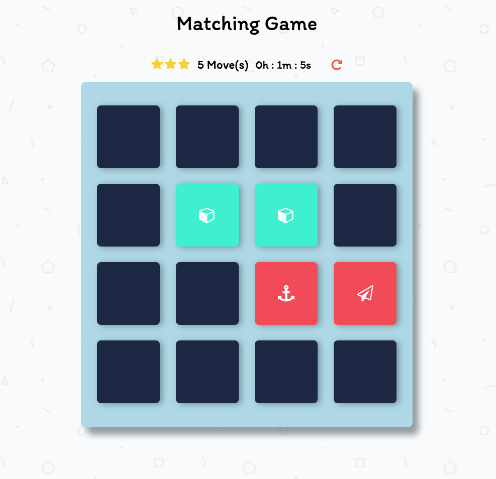

# Memory Game Project

## What is the Memory Game
This is a simple game built to test a user's memory. There's a deck of cards with different icons and each icon is shown in two cards.

## Link to Play
Tap this link to start playing the memory game https://romklao.github.io/frontend-memory-game/#

## Challenge
Match cards in less time with less moves.

## Instructions
* Click a card to display it's icon.
* Memorize each card's location to find a matched card.
* Keep revealing cards and match all cards in the deck.
* Work on matching cards with less moves in a shorter time.

## How to create the Memory Game
I manipulated the DOM with Vanilla JS, changed part of the HTML and styled the game with CSS.
* Created a deck of cards with Javascript.
* Shuffles when game is refreshed or reloaded.
* Created a counter to count a number of moves made by player.
* Set a timer to track the duration of playing.
* Added animation to cards when they are opened, matched or unmatched.
* Performed a pop-up modal of congratulation messages when a player wins a game.

